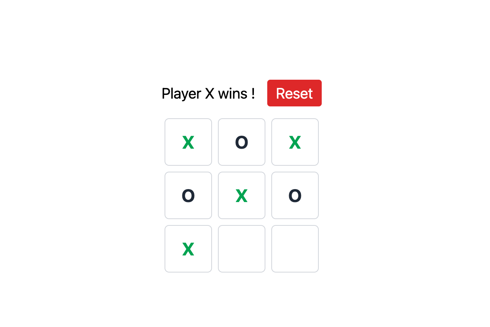

# Tic Tac Toe Game

This is a simple Tic Tac Toe game built with React. Players take turns marking spaces in a 3x3 grid. The player who succeeds in placing three of their marks in a horizontal, vertical, or diagonal row wins the game.

## Features

- Modern design with hover effects on buttons.
- Player turn indicator.
- Reset button to start a new game.
- Highlights the winning combination in green when a player wins.

## Technologies Used

- React
- Tailwind CSS
